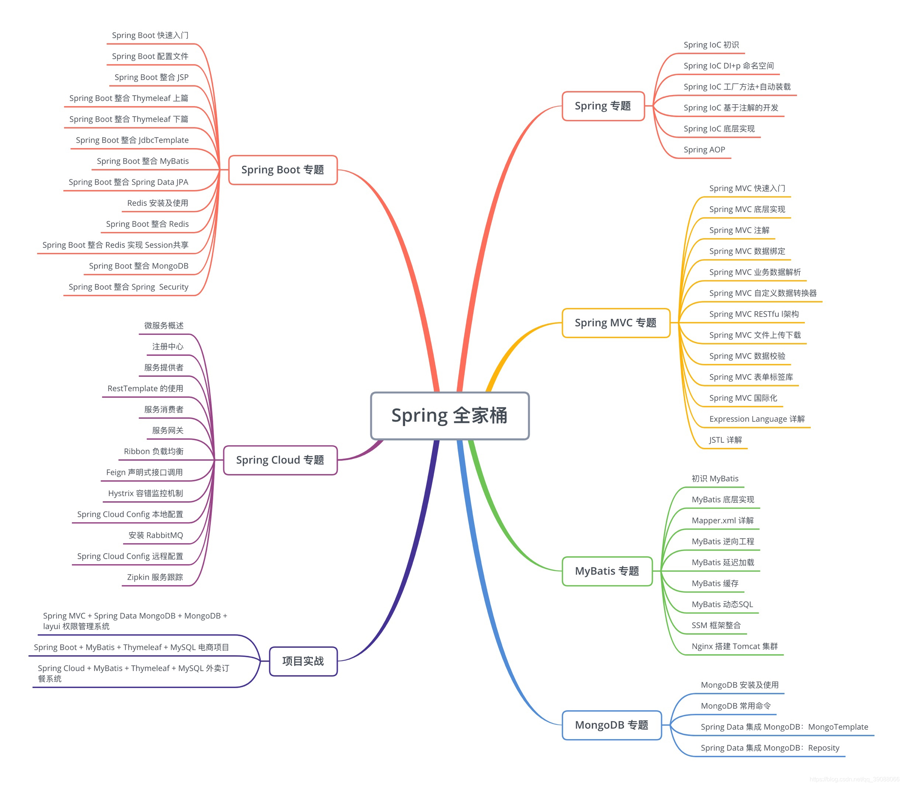
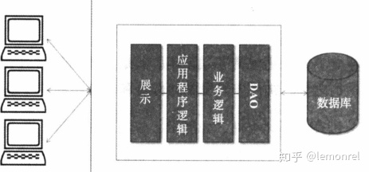

    Spring Framework 就是我们通常所说的 Spring 框架，它是一个软件设计架构层面的框架，为基于 Java 的企业级应用程序提供了一套标准流程和配置模型，可部署在任何类型的平台上。Spring 优势在于为开发者提供了应用级别的基础结构支持，实现应用层面的解耦合，允许开发者自主选择相关组件，开发者只需专注于业务逻辑的开发，不需要关注特定的部署环境。
    
    Spring Web MVC
    Spring Web MVC（官方名称）就是我们通常所说的 Spring MVC，它是 Spring Framework 中的一个模块，是 Spring Framework 在 Web 领域实现 MVC 设计模式的具体方案，主要是基于 DispatcherServer 的前端路由处理和 ViewResolver 视图解析器来简化开发者的工作效率。
    
    Spring Boot
    Spring Boot 是目前 Spring 全家桶系列中最流行的一个产品，在 Spring 官网的介绍排在第一位，可见对其重视程度，Spring 官方对 Spring Boot 的描述是“build anything”，翻译过来是构建任何事物，这样一个非常简单的描述将 Spring Boot 的特点展现的淋漓尽致，即通过 Spring Boot 可以快速构建一个基于 Spring 的独立生存级别的应用程序，开发者直接运行程序即可，无需处理各种繁琐的配置文件。简单理解，Spring Boot 就是为了让开发者快速启动和运行 Spring 应用程序而设计的。
    
    Spring Cloud
    Spring 官方对 Spring Cloud 的描述是“coordinate anything”，翻译过来是协调任何事物，通过这个描述可以明确 Spring Cloud 并不是为了实现某个业务模块而存在的，它是一个集大成者，将分布式系统开发中常用的模块进行整合，如服务注册、服务发现、配置管理、熔断器、控制总线等，基于 Spring Boot 形成一套框架体系，开箱即用，使得开发者可以快速实现分布式、微服务应用。
    
    Spring Data
    Spring Data 是 Spring 提供的持久层产品，主要功能是为应用程序中的数据访问提供统一的开发模型，同时保留不同数据存储的特殊性，并且这套开发模式是基于 Spring 的。根据不同类型的数据存储类型又可分为 Spring Data JDBC、Spring Data JPA、Spring Data Redis、Spring Data MongoDB 等，适用于关系型数据库和非关系型数据库。
    
    Spring Security
    Spring Security 是 Spring 提供的一个功能强大的安全框架，为 Java 应用程序提供授权功能，通过定制身份验证来实现对于访问权限的控制，Spring Security 的特点在于扩展性好，可以根据具体的业务需求来实现定制验证服务。

    Java微服务架构
    传统的整体式架构
    传统的整体式架构都是模块化的设计逻辑，如展示（Views）、应用程序逻辑（Controller）、业务逻辑（Service）和数据访问对象（Dao），程序在编写完成后被打包部署为一个具体的应用。如图所示：

    系统的水平扩展
    如果要对系统进行水平扩展，通常情况下，只需要增加服务器的数量，并将打包好的应用拷贝到不同的服务器，然后通过负载均衡器（Nginx）就可以轻松实现应用的水平扩展。
    整体式架构的缺点
    应用复杂度增加，更新、维护困难。
    易造成系统资源浪费。
    影响开发效率。
    应用可靠性低。
    不利于技术更新。
    面向服务的架构SOA（Service-Oriented Architecture）
    SOA的思路是把应用中相近的功能聚合在一起，以服务的形式提供出去。如图所示：

    缺点
    虽然SOA解决了整体式架构中的问题，但多数情况下，SOA中相互独立的服务仍然会部署在同一个运行环境中。和整体式架构类似，随着业务功能的增多，SOA的服务会变得越来越复杂。本质上看，整体式架构的问题并没有因为使用SOA而变得更好。
    微服务架构
    微服务架构是一种架构风格和架构思想，它倡导我们在传统软件应用架构的基础上，将系统业务按照功能拆分为更加细粒度的服务，所拆分的每一个服务都是一个独立的应用，这些应用对外提供公共的API，可以独立承担对外服务的职责，通过此种思想方式所开发的软件服务实体就是“微服务”，而围绕着微服务思想构建的一系列结构（包括开发、测试、部署等），我们可以将它称之为“微服务架构”。如图所示：

    缺点
    开发人员必须处理创建分布式系统的复杂性。
    部署的复杂性。
    增加内存消耗。
    微服务架构与SOA的区别

    如何构建微服务架构
    微服务架构的组件
    （1）服务注册中心：注册系统中所有服务的地方。
    （2）服务注册：服务提供方将自己调用地址注册到服务注册中心，让服务调用方能够方便地找到自己。
    （3）服务发现：服务调用方从服务注册中心找到自己需要调用服务的地址。
    （4）负载均衡：服务提供方一般以多实例的形式提供服务，使用负载均衡能够让服务调用方连接到合适的服务节点。
    （5）服务容错：通过断路器（也称熔断器）等一系列的服务保护机制，保证服务调用者在调用异常服务时能快速地返回结果，避免大量的同步等待。
    （6）服务网关：也称为API网关，是服务调用的唯一入口，可以在这个组件中实现用户鉴权、动态路由、灰度发布、负载限流等功能。
    （7）分布式配置中心：将本地化的配置信息（properties、yml、yaml等）注册到配置中心，实现程序包在开发、测试、生产环境的无差别性，方便程序包的迁移。
    微服务架构的技术选型
    （1）微服务实例的开发：SpringBoot
    （2）服务的注册与发现：Spring Cloud Eureka
    （3）负载均衡：Spring Cloud Ribbon
    （4）服务容错：Spring Cloud Hystrix
    （5）API网关：Spring Cloud Zuul
    （6）分布式配置中心：Spring Cloud Config
    （7）调试：Swagger
    （8）部署：Docker
    （9）持续集成：Jenkins

