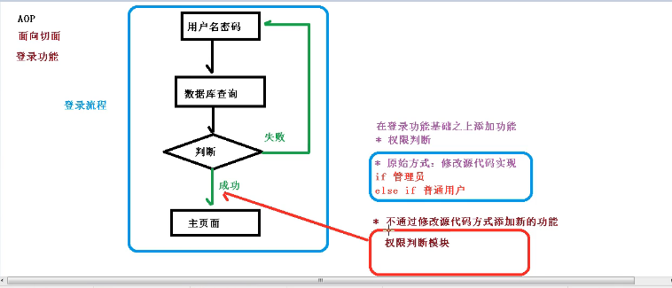
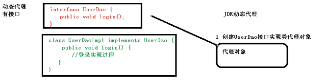
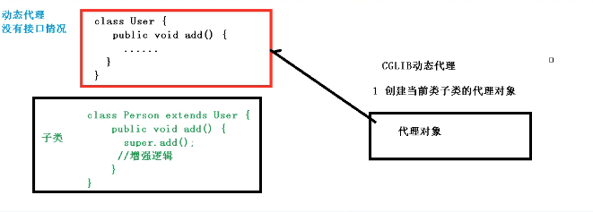
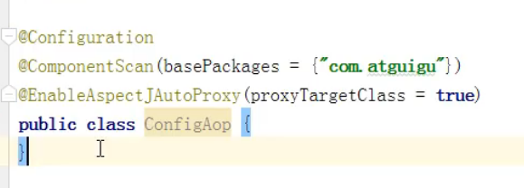

## 一.什么是AOP
    
    1.面向切面（方面）编程：利用AOP可以对业务逻辑的各个部分进行隔离，

        从而使得业务逻辑各个部分之间的耦合度降低，提高程序的可重用性，同时提高开发效率。


    2.通俗描述：不修改源代码的情况下进行功能添加。

    3.使用基本的登录功能来说明AOP

## 二.AOP底层原理
    
    1.AOP底层使用动态代理

        第一种，有接口情况，使用JDK动态代理：
                
                *创建接口实现类的代理对象，增强类的方法*


        第二种，无接口情况，使用CGLIB代理：
                
                *创建子类的代理对象，增强类的方法*


## 三.AOP的JDK动态代理

    JDK动态代理代码实现：
```java
public interface UserDao {
    public int add(int a,int b);
    public String update(String id);
}
```
```java
public class UserDaoImpl implements UserDao{
    @Override
    public int add(int a, int b) {
        return a+b;
    }

    @Override
    public String update(String id) {
        return id;
    }
}
```
```java
public class JDKProxy {

    public static void main(String[] args){

        Class[] interfaces = {UserDao.class};

//        //创建接口实现类的代理方法

//        //匿名内部类
//        Proxy.newProxyInstance(
//                JDKProxy.class.getClassLoader(), interfaces, new InvocationHandler() {
//                    @Override
//                    public Object invoke(Object proxy, Method method, Object[] args) throws Throwable {
//                        //增强方法
//                        return null;
//                    }
//                });

        UserDaoImpl userDao = new UserDaoImpl();

        //创建类实现InvocationHandler接口
        UserDao dao = (UserDao) Proxy.newProxyInstance(
                JDKProxy.class.getClassLoader(), interfaces, new UserDaoProxy(userDao));

        int res = dao.add(1,2);
        System.out.println(res);
    }
}

class UserDaoProxy implements InvocationHandler{

    //1.创建的是谁的代理对象，就把谁传进来
    //通过有参构造器传递值
    private Object obj;
    public UserDaoProxy(Object obj){
        this.obj = obj;
    }

    @Override
    public Object invoke(Object proxy, Method method, Object[] args) throws Throwable {
        //方法之前
        System.out.println("方法之前执行。。。。"+method.getName()+":传递参数.."+ Arrays.toString(args));

        //被增强的方法
        Object res = method.invoke(obj,args);

        //方法之后
        System.out.println("方法之后执行。。。。"+method.getName()+":传递参数.."+ Arrays.toString(args));
        System.out.println("方法之后执行。。。。"+obj);

        return res;
    }
}
```

    1.使用JDK动态代理，需使用Proxy类来进行代理对象的生成
        java.lang.reflect.Proxy
    
    2.调用newProxyInstance方法
        方法的三个参数：
            第一个参数：类加载器
            第二个参数：增强方法所在的类，这个类实现的接口，可以有多个接口
            第三个参数：实现这个接口InvocationHandler,创建代理对象，写增强的方法

    3.使用Proxy类创建接口代理对象
```java
public class JDKProxy {

    public static void main(String[] args){

        Class[] interfaces = {UserDao.class};

//        //创建接口实现类的代理方法

        //匿名内部类
        Proxy.newProxyInstance(
                JDKProxy.class.getClassLoader(), interfaces, new InvocationHandler() {
                    @Override
                    public Object invoke(Object proxy, Method method, Object[] args) throws Throwable {
                        //方法之前
                        System.out.println("方法之前执行。。。。"+method.getName()+":传递参数.."+ Arrays.toString(args));

                        //被增强的方法
                        Object res = method.invoke(obj,args);

                        //方法之后
                        System.out.println("方法之后执行。。。。"+method.getName()+":传递参数.."+ Arrays.toString(args));
                        System.out.println("方法之后执行。。。。"+obj);

                        return res;
                    }
                });

        UserDaoImpl userDao = new UserDaoImpl();

        //创建类实现InvocationHandler接口
        UserDao dao = (UserDao) Proxy.newProxyInstance(
                JDKProxy.class.getClassLoader(), interfaces, new UserDaoProxy(userDao));

        int res = dao.add(1,2);
        System.out.println(res);
    }
}
```

## 四.AOP专业术语
    
    1.连接点：类里面的哪些方法可以增强，那这些方法就叫连接点

    2.切入点：实际被真正增强的方法，称为切入点

    3.通知（增强）：实际增强的逻辑部分称为通知（增强）
            
            *前置通知( @Before(value = "execution(* AOP.AspectJAnnotation.User.add())") )：方法之前通知

            *后置通知(@After)：方法之后通知

            *环绕通知：方法之前之后都通知

            *异常通知：方法发送异常时通知

            *最终通知：类似于finally（最后进行通知）

    4.切面：（是一种动作）把通知应用到切入点的过程.
        


## 五.AOP操作准备

    1.Spring框架一般都是基于AspectJ实现AOP操作

        （1）什么是AspectJ:

            *AspectJ不是Spring组成部分，独立于AOP框架，一般把AspectJ和Spring框架一起使用，进行AOP操作

    2.切入点表达式

        （1）切入点表达式作用：知道对哪个类里面的哪个方法进行增强

        （2）语法结构：

                execution( [权限修饰符(一般*代替)].[返回类型].[类全路径].[方法名称]（[参数列表]）)

                举例1：对com.gy.dao.BookDao类里面的add方法进行增强 
```java
                        execution(*com.gy.dao.BookDao.add(...))
```                     
                举例2：对com.gy.dao.BookDao类里面的所有方法进行增强
```java
                        execution(*com.gy.dao.BookDao.*(...))
```  
                举例3：对com.gy.dao包里面的所有类，所有方法进行增强
```java
                        execution(*com.gy.dao.*.*(...))
```  
    3.基于AspectJ实现AOP操作

        （1）基于xml配置文件实现
        

            **纯注解开发配置类


        （2）基于注解实现

                2.1) 创建类，在类里面定义方法
```java
//被增强的类
public class User {
    public void add(){
        System.out.println("add........");
    }
}
```
                2.2) 创建增强类(编写增强逻辑)
```java
//增强的类
public class UserProxy {
    //前置通知
    public void before(){
        System.out.println("before.........");
    }
}
```
                2.3) 进行通知配置：

                        第一步.Spring配置文件中，开启组件扫描
```xml
<!--  
    导入组件扫描名称空间
    xmlns:context="http://www.springframework.org/schema/context"
    http://www.springframework.org/schema/context http://www.springframework.org/schema/context/spring-context.xsd
-->
<!--    开启组件扫描-->
    <context:component-scan base-package="AOP.AspectJAnnotation"></context:component-scan>
```                       
                        第二步.使用注解创建User和UserProxy对象
```java
//被增强的类
@Component
public class User {
    public void add(){
        System.out.println("add........");
    }
}
```
```java
//增强的类
@Component
public class UserProxy {
    //前置通知
    public void before(){
        System.out.println("before.........");
    }
}
```
                        第三步.在增强类上面添加注解@Aspect
```java
//增强的类
@Component
@Aspect
public class UserProxy {
    //前置通知
    public void before(){
        System.out.println("before.........");
    }
}
```
                        第四步.在Spring配置文件中开启生成代理对象
```xml
<!--
    导入aop名称空间
    xmlns:aop="http://www.springframework.org/schema/aop"
    http://www.springframework.org/schema/aop http://www.springframework.org/schema/aop/spring-aop.xsd
  
-->
<!--开启AspectJ生成代理对象-->
    <aop:aspectj-autoproxy></aop:aspectj-autoproxy>
```
                2.4) 配置五种不同类型的通知

```java
//增强的类
@Component
@Aspect//生成代理对象
public class UserProxy {
    //前置通知
    @Before(value = "execution(* AOP.AspectJAnnotation.User.add())")
    public void before(){
        System.out.println("before.........前置通知");
    }

    //后置通知（返回通知）
    @AfterReturning(value = "execution(* AOP.AspectJAnnotation.User.add())")
    public void afterReturning(){
        System.out.println("AfterReturning.........后置通知");
    }

    //环绕通知
    @Around(value = "execution(* AOP.AspectJAnnotation.User.add())")
    public void around(ProceedingJoinPoint proceedingJoinPoint) throws Throwable{
        System.out.println("Around.........环绕通知之前");
        //增强的方法
        proceedingJoinPoint.proceed();
        System.out.println("Around.........环绕通知之后");
    }

    //最终通知
    @After(value = "execution(* AOP.AspectJAnnotation.User.add())")
    public void after(){
        System.out.println("After.........最终通知");
    }

    //异常通知
    @AfterThrowing(value = "execution(* AOP.AspectJAnnotation.User.add())")
    public void afterThrowing(){
        System.out.println("AfterThrowing.........异常通知");
    }

}
```
                2.5）抽取相同切入点   @Pointcut(value = "execution(* AOP.AspectJAnnotation.User.add())")

```java
//增强的类
@Component
@Aspect//生成代理对象
public class UserProxy {

    //抽取相同切入点
    @Pointcut(value = "execution(* AOP.AspectJAnnotation.User.add())")
    public void pointCut() {
    }

    //前置通知
    @Before(value = "pointCut()")
    public void before() {
        System.out.println("before.........前置通知");
    }

    //后置通知（返回通知）
    @AfterReturning(value = "pointCut()")
    public void afterReturning() {
        System.out.println("AfterReturning.........后置通知");
    }

    //环绕通知
    @Around(value = "pointCut()")
    public void around(ProceedingJoinPoint proceedingJoinPoint) throws Throwable {
        System.out.println("Around.........环绕通知之前");
        //增强的方法
        proceedingJoinPoint.proceed();
        System.out.println("Around.........环绕通知之后");
    }

    //最终通知
    @After(value = "pointCut()")
    public void after() {
        System.out.println("After.........最终通知");
    }

    //异常通知
    @AfterThrowing(value = "pointCut()")
    public void afterThrowing() {
        System.out.println("AfterThrowing.........异常通知");
    }
}
```
                2.6)同一个方法有多个增强类进行增强时，可以设置增强类的优先级
    
                    a.在增强类上面添加@Order（数字类型值），数字类型值越小优先级越高
```java
@Component
@Aspect
@Order(1)
public class PersonProxy(){
    
}
```