## 一.什么是IOC

    1.控制反转,把对象的创建和对象之间的调用过程，交给Spring进行管理

    2.使用IOC目的，为了耦合度降低

    3.User入门案例就是IOC实现

## 二.IOC底层原理

    1.xml解析、工厂设计模式、反射

## 三.画图解析IOC底层
    
    1.原始方法：
    
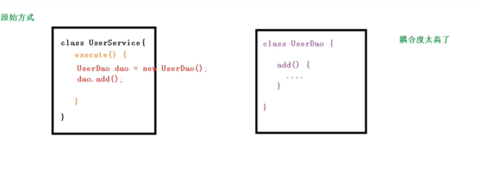

    2.工厂模式：

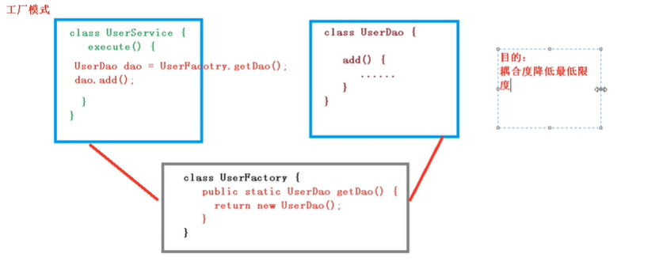

    3.工厂降低耦合之后再通过xml解析以及反射进一步进行解耦

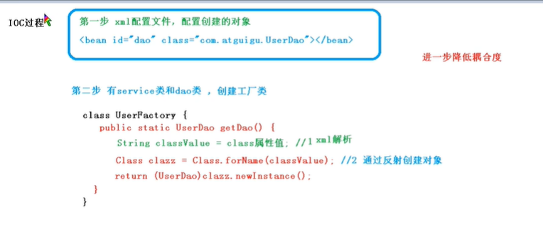


## 四.IOC(接口)

    1.IOC思想基于IOC容器完成，IOC容器底层就是对象工厂。

    2.Spring提供IOC容器实现两种方式（两个接口）。

        （1）BeanFactory: IOC容器基本实现，是Spring内部的使用接口，不提供开发人员使用。

			 *BeanFatory: 加载配置文件时候不会创建对象，在获取对象（使用）才会去创建对象。

	    （2）ApplicationContext: BeanFactory接口的子接口，提供更多更强大的功能，一般由开发人员使用

			 *ApplicationContext：加载配置文件时候就会把配置文件对象进行创建。

    3.ApplicationContext的两个实现类

    小技巧：Ctrl+H 查看类结构
    
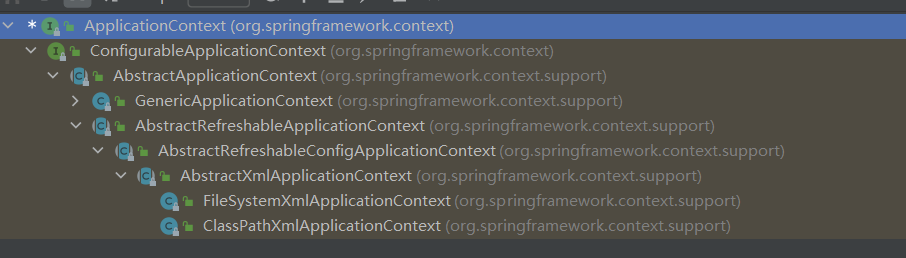

## 五.IOC操作Bean管理

    1.什么是Bean管理

        （0）Bean管理实际上是两个操作

        （1）Spring创建对象（创建类）

        （2）Spring注入属性（设置属性，好比set方法设值）

    2.Bean管理操作有两种方式

        （1）基于xml配置文件方式实现

            1.1）基于xml方式创建对象
```xml
<!--1.创建Usr对象   id 别名     class 类路径-->
<bean id="User" class="Beans.User">
    <!-- 没有进行依赖注入        -->
</bean>
```
                    a）在Spring配置文件中使用bean标签，标签里面添加对应属性，就可以实现对象创建

                    b）bean标签常用属性: id属性：唯一标识、class属性：类全路径（包和类路径） 、name属性：和id属性作用一样，但name属性可以加特殊符号（/。、等）id属性不可以

                    c）创建对象时，默认调用无参构造方法完成对象创建

            1.2）基于xml方式注入属性

                    a）DI:依赖注入，就是注入属性，是IOC中的具体实现

                    1.2.1）第一种注入方式：使用set方法进行注入

                        a）创建对应的属性以及set方法
```java
/**
 * 使用set方法进行依赖注入
 */
public class Book {
    //属性创建
    private String bname;
    private String bauthor;
    //set方法
    public void setBname(String bname){
        this.bname = bname;
    }

    public void setBauthor(String bauthor){
        this.bauthor = bauthor;
    }

    public void testDemo(){
        System.out.printf(bname+"="+bauthor);
    }
}
```
                        b）在spring配置文件中配置对象创建，配置属性注入
```xml
   <!--2.set方法注入属性（依赖注入）-->
    <bean id="book" class="IOC.Dao.Book">
        <!-- 使用Property完成依赖注入
             name:类属性名称
             value: 向属性注入的值
         -->
        <property name="bname" value="十万个为什么"></property>
        <property name="bauthor" value="十万"></property>
    </bean>
```
                    1.2.2）第二种注入方式：使用有参构造器进行注入

                        a）创建对应的属性以及有参构造器
```java
/**
 * 使用有参构造器进行依赖注入
 */
public class Orders {

    private String oname;
    private String address;

    public Orders(String oname,String address){
        this.oname = oname;
        this.address = address;
    }
}

```
                        b）在spring配置文件中配置对象创建，配置属性注入
```xml
    <!--3.有参构造器注入属性（依赖注入）-->
    <bean id="orders" class="IOC.Service.Orders">
<!--        有参构造器-->
        <constructor-arg name="oname" value="榴莲酥"></constructor-arg>
        <constructor-arg name="address" value="光谷百货大楼"></constructor-arg>

        <!--        有参构造器索引取值-->
<!--        <constructor-arg index="0" value="光谷百货大楼"></constructor-arg>-->
    </bean>
```


                    1.2.3）P名称空间注入

                        a）使用P名称空间注入，可以简化基于xml配置方式

                                添加p名称空间约束
```xml
<beans xmlns:p="http://www.springframework.org/schema/p"></beans>
```
                                进行依赖注入
```xml
    <!--4.p名称空间注入属性（依赖注入）-->
    <bean id="book" class="IOC.Dao.Book" p:bname="十万个为什么" p:bauthor="十万">
    </bean>
```
        （2）基于注解方式实现
        
            2.0) 什么是注解
                
                注解是代码特殊标记,格式:   @注解名称(属性名称=属性值,属性名称=属性值)
                
                使用注解: 注解作用在类上面,属性上面,方法上面

                使用注解目的:简化xml配置

            2.1）基于注解方式创建对象

                ①.@Component

                ②.@Service

                ③.@Controller

                ④.@Repository
                
                *上面四个注解功能是一样的,都可以用来创建bean实例

                *注解实现对象创建:

                第一步,引入依赖:
        
                    spring-aop-5.2.6.RELEASE.jar

                第二步,开启主键扫描:
```xml
<!--开启组件扫描-->
<!--添加context名称空间-->
<!--        xmlns:context="http://www.springframework.org/schema/context"
            http://www.springframework.org/schema/context http://www.springframework.org/schema/context/spring-context.xsd
-->
<!--扫描单个包-->
<context:component-scan base-package="Annotation"></context:component-scan>
<!--扫描多个包-->
<context:component-scan base-package="Annotation,AutoWrite"></context:component-scan>
<!--扫描上层目录-->
<context:component-scan base-package="java"></context:component-scan>
```
                    **组件扫描中的两个细节：
```xml
<!--开启组件扫描中的细节-->
<!--细节1：设置扫描那些内容,扫描带相应注解的类-->
<!--
use-default-filters="false" 表示现在不使用默认的filter,自己配置filter。

设置扫描那些内容,扫描带相应注解的类
<context:include-filter type="annotation" expression="org.springframework.stereotype.Service"/>

-->
<context:component-scan base-package="Annotation" use-default-filters="false">
    <context:include-filter type="annotation" expression="org.springframework.stereotype.Service"/>
</context:component-scan>

<!--细节2：设置不去扫描那些带有相应注解的类-->
<!--   
    <context:exclude-filter type="annotation" expression="org.springframework.stereotype.Service"/>
-->
<context:component-scan base-package="Annotation" use-default-filters="false">
    <context:exclude-filter type="annotation" expression="org.springframework.stereotype.Service"/>
</context:component-scan>
```

                第三步,创建类,在类上面添加创建对象注释:
```java
//在注解里面value属性值可以省略不写
//默认值是类名称,首字母小写
@Service(value = "userService")//<bean id="userService" class="...">
public class UserService {

    public void add(){
        System.out.println("Service add");
    }
    
}
```
            2.2）基于注解方式实现属性注入

                ①.@Autowired:根据类型进行自动装配

                    第一步：添加创建对象的注解
                    
```java
public interface UserDao {
    public void add();
}
```
```java
@Repository(value = "userDaoImpl")
public class UserDaoImpl implements UserDao{

    @Override
    public void add() {
        System.out.println("UserDaoImpl add");
    }
}
```
                    第二步：添加创建对象的注解
```java
//在注解里面value属性值可以省略不写
//默认值是类名称,首字母小写
@Service(value = "userService")//<bean id="userService" class="...">
public class UserService {

    //定义dao类型属性
    //不需要添加set方法
    //添加注入属性注解
    @Autowired
    private UserDao userDao;

    public void add(){
        System.out.println("Service add");
    }
}
```
                ②.@Qualifier:根据名称进行依赖注入
                   
                     第一步：添加创建对象的注解
```java
@Repository(value = "userDaoImpl2")
public class UserDaoImpl2 implements UserDao{

    @Override
    public void add() {
        System.out.println("UserDaoImpl add");
    }
}
```
                    第二步：添加创建对象的注解
```java
@Service(value = "userService")//<bean id="userService" class="...">
public class UserService {

    //定义dao类型属性
    //不需要添加set方法
    //添加注入属性注解
    @Autowired
    //根据名称注入
    @Qualifier(value = "userDaoImpl2")
    private UserDao userDao;

    public void add() {
        System.out.println("Service add");
    }
}
```
                ③.@Resource:可以根据属性类型注入，可以根据名称注入
```java
//@Resource是javax扩展包中的
import javax.annotation.Resource;

@Service(value = "userService")//<bean id="userService" class="...">
public class UserService {
    
    //根据类型注入
    @Resource
    //根据名称注入
    @Resource(name = "userDapImpl")
    private UserDao userDao;

    public void add() {
        System.out.println("Service add");
    }
}
```
                ④.@Value:注入普通类型属性
```java
@Service(value = "userService")//<bean id="userService" class="...">
public class UserService {

    @Value(value = "哈哈")
    private Sting name;

    private UserDao userDao;

    public void add() {
        System.out.println("Service add");
    }
}
```

    3.xml注入其它类型属性值

        3.1) 注入Null属性值
```xml
   <!--5.注入Null属性值（依赖注入）-->
    <bean id="book" class="IOC.Dao.Book" >
        <property name="bname" >
            <null></null>
        </property>
    </bean>
```
        3.2) 注入包含特殊符号的属性值
```xml
    <!--6.注入包含特殊符号的属性值（依赖注入）
        1.将特殊符号进行转译
        2.将特殊符号内容写入CDATA
    -->
    <bean id="book" class="IOC.Dao.Book" >
        <property name="bname" >
            <value><![CDATA[<<南京>>]]></value>
        </property>
    </bean>
```
        3.3) 注入属性-外部bean
```xml
    <!--7.注入外部bean属性值（依赖注入）
       1.name属性：类里面属性名称
       2.ref属性：创建userDao对象，bean标签的id值
   -->
<bean id="book" class="IOC.Dao.Book" >
    <property name="OrdersDao" ref="orders" ></property>
</bean>
<bean id="orders" class="IOC.Dao.Orders"></bean>
```
        3.4) 注入属性-内部bean(级联赋值)
```xml
    <!-- 内部bean -->
    <bean id="Emp" class="IOC.Bean.Emp">
        <!--设置两个普通属性-->
        <property name="ename" value="哈哈"></property>
        <property name="gender" value="男"></property>
        <!--设置对象类型属性-->
        <property name="dept">
            <bean id="Dept" class="IOC.Bean.Dept" >
                <property name="dname" value="安保部门"></property>
            </bean>
        </property>
    </bean>
```
        3.5) 注入属性-级联赋值

            第一种方式级联赋值

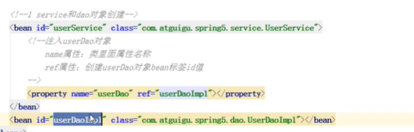
            
            第二种方式级联赋值

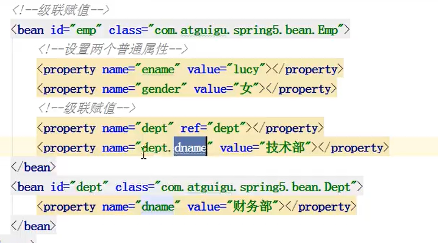


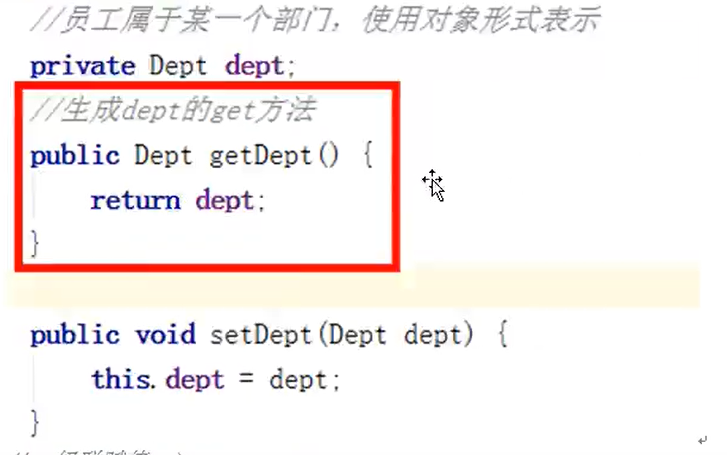
        
            *得生成get方法

        3.6) 注入集合属性
```xml
<bean id="Stu" class="IOC.Collect.Stu">
<!--        数组类型属性注入-->
        <property name="course">
            <array>
                <value>Java</value>
                <value>Nodejs</value>
                <value>MySQL</value>
            </array>
        </property>
        <!--        List集合类型属性注入-->
        <property name="list">
            <list>
                <value>Java</value>
                <value>Nodejs</value>
                <value>MySQL</value>
            </list>
        </property>
        <!--        Map集合类型属性注入-->
        <property name="map">
            <map>
                <entry key="Java" value="Java"></entry>
                <entry key="PHP" value="Java"></entry>
                <entry key="Nodejs" value="Java"></entry>
            </map>
        </property>
        <!--        Set集合类型属性注入-->
        <property name="set">
            <set>
                <value>Java</value>
                <value>Nodejs</value>
                <value>MySQL</value>
            </set>
        </property>
    </bean>
```
        3.7) 注入集合中属性为对象的属性

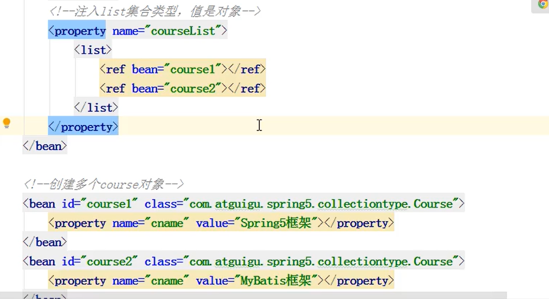 

            抽取集合中的公共部分
```xml
<!--    1.进行xml文件配置 设置标签util空间-->
<!--    xmlns:util="http://www.springframework.org/schema/util"-->
<!--    http://www.springframework.org/schema/util http://www.springframework.org/schema/util/spring-util.xsd-->

<!--    2.提取list集合公共部分-->
        <util:list id="bookList">
            <value>Java</value>
            <value>Nodejs</value>
            <value>Vue</value>
        </util:list>
<!--    3.属性注入-->
        <bean id="Book" class="IOC.Collect.Book">
            <property name="list" ref="bookList" ></property>
            <property name="bname" value=""></property>
        </bean>
```

    4.工厂bean(FactoryBean)

        4.1）Spring有两种类型bean,一种普通bean,另一种工厂bean(FactoryBean) 

            4.2）普通bean;在配置文件中定义的bean类型就是返回类型

            4.3）工厂bean;在配置文件定义bean类型可以和返回类型不一样

                第一步 创建类，让这个类作为工厂bean,实现接口FactoryBean

                第二步 实现接口里面的方法，在实现的方法中定义返回的bean类型
```java
public class MyBean implements FactoryBean<Book> {
    @Override
    public Book getObject() throws Exception {
        Book book = new Book();
        book.setBname("哈哈");
        return book;
    }

    @Override
    public Class<?> getObjectType() {
        return null;
    }

    @Override
    public boolean isSingleton() {
        return false;
    }
}
```
    5.bean的作用域(在Spring里面，设置创建bean实例是单实例还是多实例)

        5.1) 在Spring里面，默认创建的bean为单实例,一般默认不写(scope="singleton")。

        5.2) 在Spring里面，默认创建的bean为多实例时设置scope="prototype"。

            ***singleton 和 prototype 的区别:***

            1.singleton 为单实例，prototype 为多实例；

            2.设置scope值为singleton时，加载Spring配置文件时就会创建实例对象

              设置scope值为prototype时，调用getBean方法时会创建实例对象

        5.3) scope="request",一次请求，每次创建对象都会将其放进request中

        5.4) scope="session",一次会话，每次创建对象都会将其放进session中

    6.bean的生命周期（从对象创建到对象销毁的过程，五个步骤）
        
        a.通过构造器创建bean实例(无参数构建)

        b.为bean的属性设置值和对其他bean引用（调用set方法）

            **把bean实例传递给bean后置处理器的方法 

        c.调用bean的初始化方法（需要进行配置）init-method="自定义初始化方法名"
```xml
    <bean id="Orders" class="Beans.Orders" init-method="initMethod" destroy-method="destroyMethod">
        <property name="oname" value="学习bean的生命周期"></property>
    </bean>
```
            **把bean实例传递给bean后置处理器的方法 

        d.bean可以使用了（对象获取到了）
        
        e.当容器关闭的时候，调用bean的销毁的方法（需要进行配置销毁的方法）destroy-method="自定义销毁方法名"
```xml
    <bean id="Orders" class="Beans.Orders" init-method="initMethod" destroy-method="destroyMethod">
        <property name="oname" value="学习bean的生命周期"></property>
    </bean>
```
        ***bean生命周期的后置处理器，besn的生命周期实际有7步
            
            实现BeanPostProcessor，重写其中的两个后置处理器,在xml文件中配置后置处理器bean
```java
public class OrdersPost implements BeanPostProcessor {

    @Override
    public Object postProcessBeforeInitialization(Object bean, String beanName) throws BeansException {
        System.out.println("初始化之间传递bean");
        return null;
    }

    @Override
    public Object postProcessAfterInitialization(Object bean, String beanName) throws BeansException {
        System.out.println("初始化之后传递bean");
        return null;
    }
}
```
```xml
<!--    配置后置处理器-->
    <bean id="OrdersPost" class="Beans.OrdersPost"></bean>
```
    7.xml文件自动装配
        
        7.1）根据指定装配规则（属性名称或者属性类型），String自动匹配属性值进行注入
```xml
<!--   手动装配-->
<!--    <bean id="Emp" class="AutoWrite.Emp">-->
<!--        <property name="dept" ref="Dept"></property>-->
<!--    </bean>-->
<!--    <bean id="Dept" class="AutoWrite.Dept"></bean>-->


<!--    自动装配-->
<!--    bean标签属性autowire,配置自动装配-->
<!--    autowire属性常用两个值:
                    byName根据属性名称注入,注入值bean的id值和类属性名称一样
                    byType根据属性类型注入
-->
    <bean id="Emp" class="AutoWrite.Emp" autowire="byName"></bean>
    <bean id="Dept" class="AutoWrite.Dept"></bean>
```
    8.引入外部属性文件(properties文件)

        8.1) 直接配置数据库信息

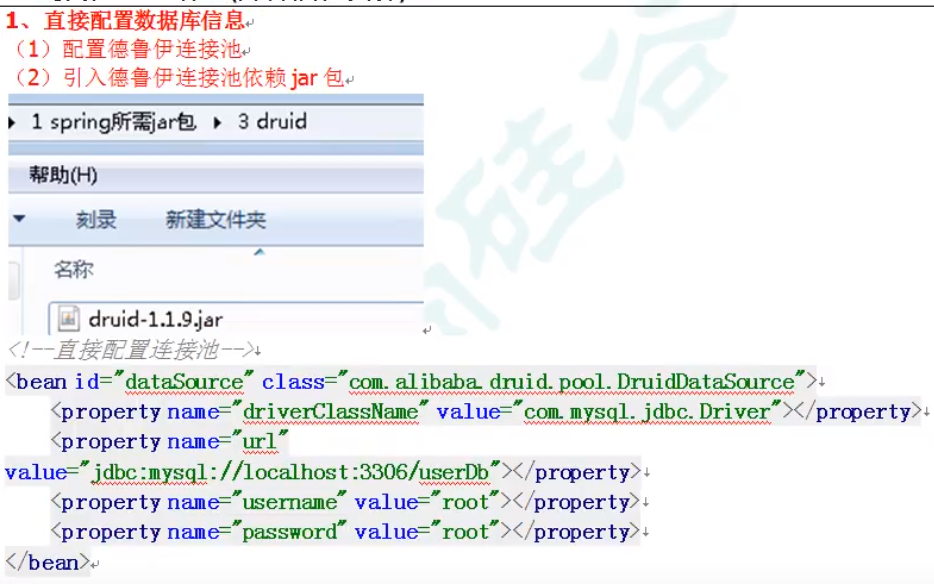

        8.2) 外部properties文件配置数据库信息

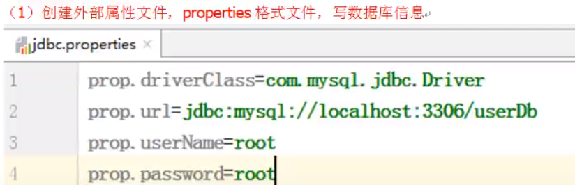
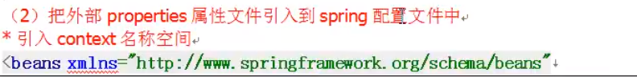
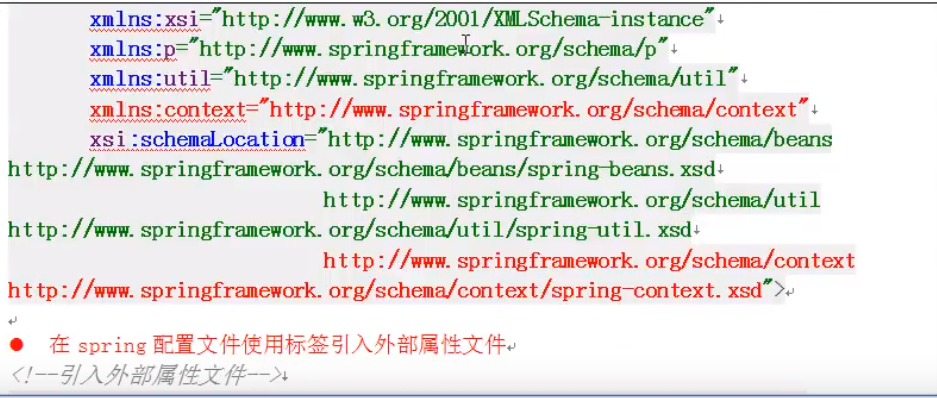
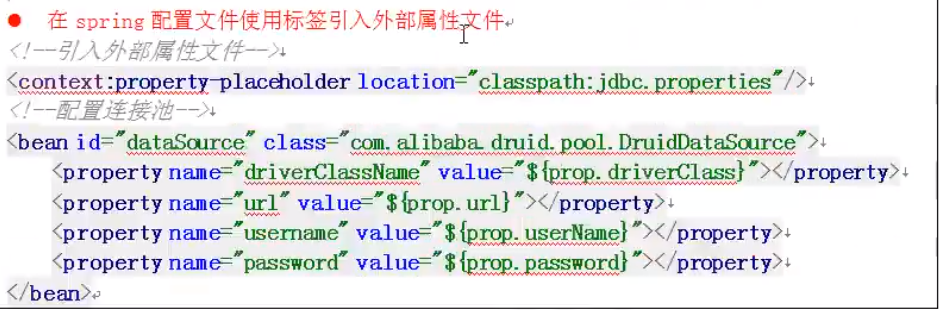

    9.纯注解开发

        第一步：使用 @Configuration 注解，创建配置类，替代xml文件，
```java
//配置类,替代xml文件
@Configuration
//组件扫描注解 <context:component-scan base-package="Annotation"></context:component-scan>
@ComponentScan(basePackageClasses = {"Annotation"})
public class AnnotationDev {
}
```
        第二步:测试类(AnnotationConfigApplicationContext)
```java
public class AnnotationTest {
    @Test
    public void test(){
        ApplicationContext context =
                new AnnotationConfigApplicationContext(AnnotationDev.class);
        UserService userService = context.getBean("userService",UserService.class);
        userService.add();
    }
}
`