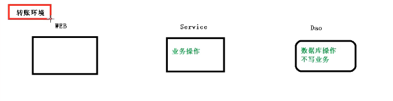
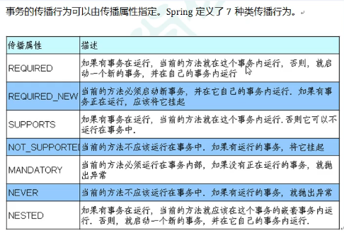
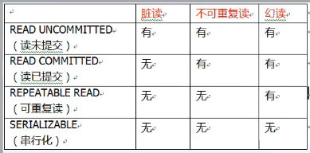
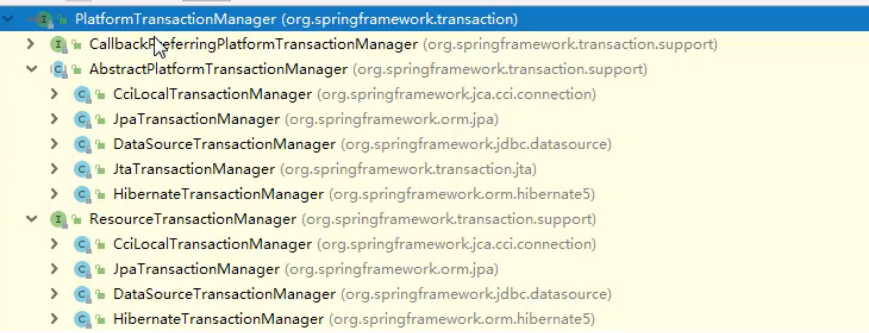
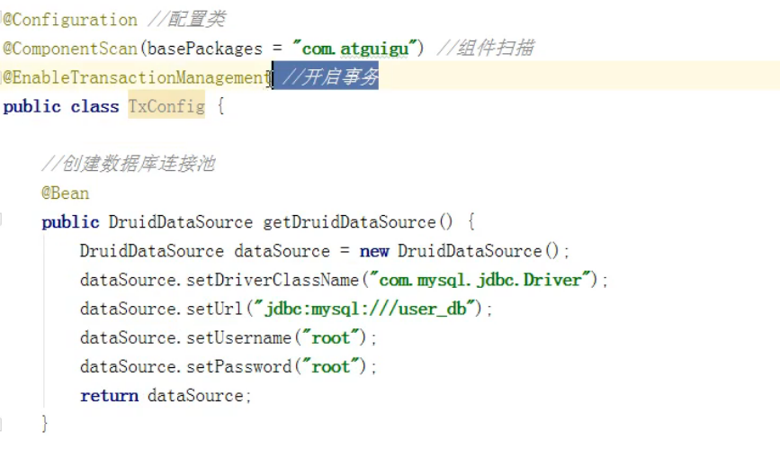
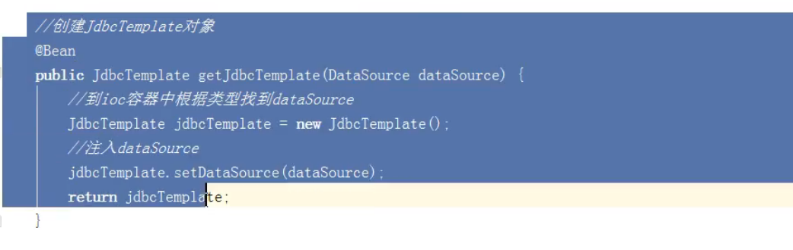
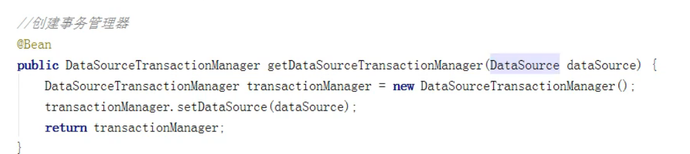

## 一.什么是事务

    （1）事务是数据库操作最基本单元，逻辑上一组操作，要么都成功，如果有一个失败所有操作都失败

    （2）典型情景：转账

## 二.事务四个特性（ACID）
    
    (1)原子性：要么都成功，要么都失败

    (2)一致性：

    (3)隔离性：

    (4)持久性：

## 三.事务操作（操作环境搭建）



## 四.事务操做流程

    1.事务一般添加到javaEE三层结构里面Service层(业务逻辑层)

    2.在Spring进行事务管理操作
        
        有两种方式：编程式事务管理和声明式事务管理
        
            编程式：
```java
public class MoneyService(){
    try{
//        第一步 开启异常

//        第二步 进行事务操作
                
//        第三步 没有发生异常提交事务
    }catch(Exception e){
//        第四步 出现异常,事务回滚
    }
}
```
            声明式：

                基于注解方式

                    第一步：Spring配置文件中配置事务管理器
```xml
    <!--数据库连接池-->
    <bean id="dataSource" class="com.alibaba.druid.pool.DruidDataSource" destroy-method="close">
        <property name="url" value="jdbc:mysql://localhost:3306/sql"></property>
        <property name="username" value="root"></property>
        <property name="password" value="123456"></property>
        <property name="driverClassName" value="com.mysql.jdbc.Driver"></property>
    </bean>
    <!--创建事务管理器-->
    <bean id="dataSourceTransactionManager" class="org.springframework.jdbc.datasource.DataSourceTransactionManager">
        <property name="dataSource" ref="dataSource"></property>
    </bean>
```
                    第二步 开启事务注解
```xml
    <!-- 开启事务注解
        1.添加名称空间  tx
         xmlns:tx="http://www.springframework.org/schema/tx"
        http://www.springframework.org/schema/tx http://www.springframework.org/schema/tx/spring-tx.xsd
    -->
    <tx:annotation-driven transaction-manager="dataSourceTransactionManager"></tx:annotation-driven>
 
    
```
                    第三步 在相应的地方添加事务注解 @Transactional (可以添加到类上面,也可以添加到方法上面)
                            
                          *@Transactional(propagation = propagation.REQUIRED)

                            注解参数配置:

                                propagation(propagation = propagation.REQUIRED):事务传播行为
                                    a.多事务方法直接进行调用,这个过程中事务如何进行管理


                                ioslation:事务隔离级别
                                    a.事务特性称为隔离性,多事务操作之间不会产生影响,不考虑隔离性产生很多问题
                                    b.有三个问题:脏读,不重复读,幻读
                                    c.脏读:一个未提交的事务读取到另一个未提交事务的数据
                                    d.不重复读:一个未提交的事务读取到一个已提交事务修改的数据
                                    e.幻读:一个未提交的事务读取到一个已提交事务添加的数据


                                timeout:事务超时时间
                                    a.事务需要在一定时间内进行提交,如果不提交进行回滚
                                    b.默认值为-1,设置时间以秒为单位计算
                            
                                readOnly:事务是否只读
                                    a.读:查询操作,写:添加修改删除操作
                                    b.设置readOnly值为true,只能查询

                                rolibackFor:事务回滚
                                    a.设置出现哪些异常进行事务回滚
 
                                NoRolibackFor:事务不回滚
                                    a.设置出现哪些异常不进行事务回滚

                基于xml配置文件方式:
      
                    第一步;配置事务管理器
```xml
    <!--数据库连接池-->
    <bean id="dataSource" class="com.alibaba.druid.pool.DruidDataSource" destroy-method="close">
        <property name="url" value="jdbc:mysql://localhost:3306/sql"></property>
        <property name="username" value="root"></property>
        <property name="password" value="123456"></property>
        <property name="driverClassName" value="com.mysql.jdbc.Driver"></property>
    </bean>
    <!--创建事务管理器-->
    <bean id="dataSourceTransactionManager" class="org.springframework.jdbc.datasource.DataSourceTransactionManager">
        <property name="dataSource" ref="dataSource"></property>
    </bean>
```
                    第二步;配置通知
```xml
<tx:advice id="txadvice">
    <!-- 配置事务参数-->
    <tx:attributes>
<!--        指定哪种规则的方法上面添加事务以及 7种参数-->
        <tx:method name="accountMoney"></tx:method>
        
        <tx:method name="account*"></tx:method>
    </tx:attributes>
</tx:advice>
```
                    第三步;配置切入点和切面
```xml
<aop:config>
<!--    配置切入点-->
    <aop:pointcut id="pt"  expression="execution(* AOP.AspectJAnnotation.User.add())">
    </aop:pointcut> 
<!--    配置切面-->
    <aop:advisor advice-ref="txadvice" pointcut-ref="pt"></aop:advisor>
</aop:config>
```

    3.在Spring进行声明式事务管理，底层使用AOP原理

    4.Spring事务管理API

        1).提供一个接口，代表事务管理器，这个接口针对不同的框架提供不同的实体类



    5.纯注解开发注解配置





## @NullAble注解使用在方法上面,属性上面,方法参数里面代表,方法返回值可以为空,属性值可以为空,方法参数可以为空