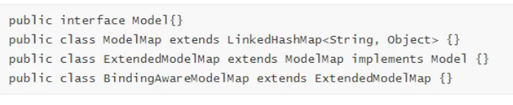

## 使用servletAPI向request域对象共享数据
```java
    @RequestMapping("/testServletAPI")
    // 形参位置的request表示当前请求
    public string testservletAPI (HttpservletRequest request) {
            request.setAttribute("testScope","say,hello")
            return "success";
    }
```

## 使用ModelAndView向request域对象共享数据
```java
    //通过ModelAndView进行共享数据
    @RequestMapping("/testMAV")
    public ModelAndView modelAndView(){
        /**
         * ModelAndView有Model和View功能
         * Model主要用于向请求域共享数据
         * view主要用于设置试图，实现页面跳转
         */
        ModelAndView modelAndView = new ModelAndView();
        //向请求域共享数据
        modelAndView.addObject("testScope","hello");
        //设置试图，实现页面跳转
        modelAndView.setViewName("index");
        return modelAndView;
    } 
    
    
    //通过Model进行共享数据
    @RequestMapping("/testM")
    public String testM(Model model){
        //向请求域共享数据
        model.addObject("testScope","hello2");
        return "success";
    }

    //通过Map进行共享数据
    @RequestMapping("/testMap")
    public String testMap(Map<String,Object> map){
        //向请求域共享数据
        map.put("testScope","hello3");
        return "success";
    }
    
    
    //通过ModelMap进行共享数据
    @RequestMapping("/testMM")
    public String testMM(ModelMap modelMap){
        //向请求域共享数据
        modelMap.addAttribute("testScope","hello4")
        return "success";
    }   
    
    
    
```
## Model.ModelMap,Map的关系
    
    Model,ModelMap,Map类型的参数其实本质上都是BindingAwareModeLMap类型的


## 向session域中共享数据
````java

    //使用原生ServletAPI的httpSession
    @RequestMapping("/testSession")
    public String testSession(HttpSession httpSession){
        //向session请求域共享数据
        httpSession.setAttribute("testScope","hello session")
        return "success";
    }   
````

## 向application域对象共享数据
````java
    @RequestMapping("/testApplication")
    public String testApplication(HttpSession httpSession){
        ServletContext application = httpSession.getContext();
        application.setAttribute("testScope","hello testApplication")
        return "success";
    }   
````