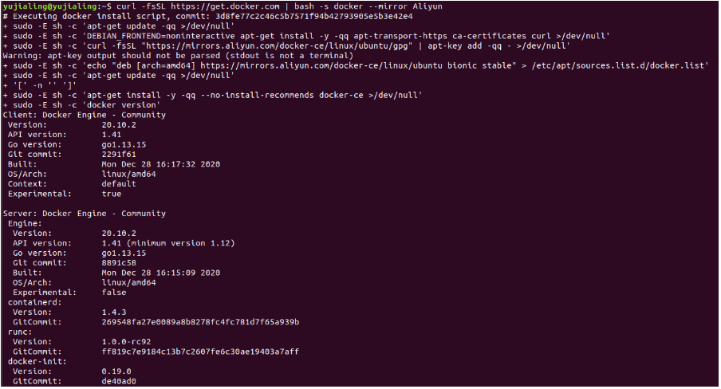
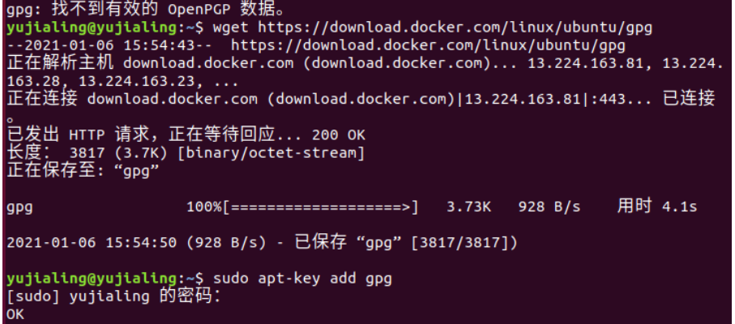
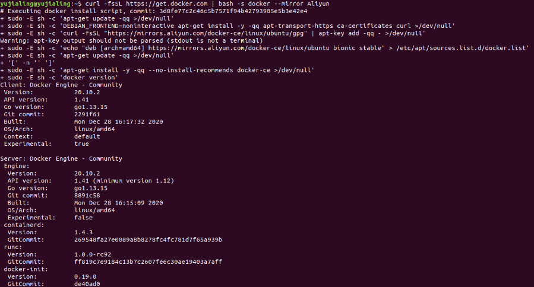
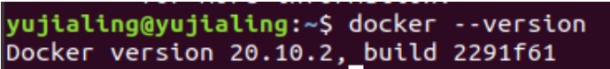
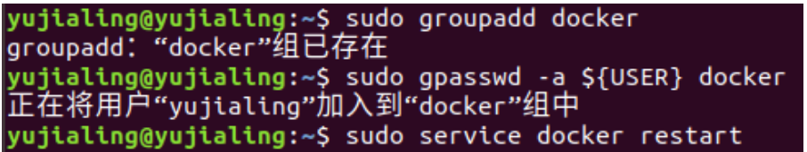
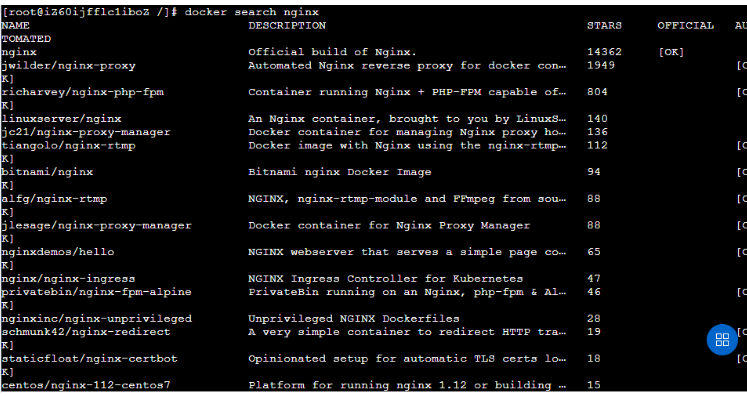
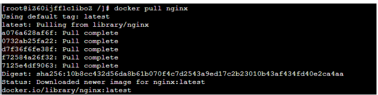
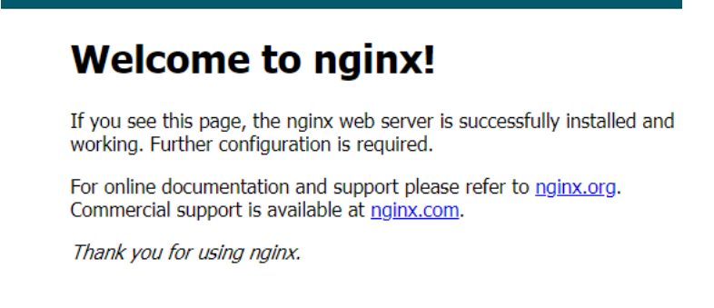

## Linux系统安装Docker
    1.安装
    
    命令：
    
    curl -fsSL https://get.docker.com | bash -s docker --mirror Aliyun

    如果有 `gpg: 找不到有效的 OpenPGP 数据` 的报错，
    
    在Ubuntu系统上安装docker时出现`gpg: 找不到有效的 OpenPGP 数据`的报错

    解决方案：

    wget https://download.docker.com/linux/ubuntu/gpg
    
    sudo apt-key add gpg
    
    12

    随后再次执行下载指令，解决报错

    解决`gpg: 找不到有效的 OpenPGP 数据`的报错
    
    2.验证docker是否安装成功
    
    docker --v

    3.将当前用户加入docker用户组
    
    sudo groupadd docker
    
    sudo gpasswd -a ${USER} docker
    
    sudo service docker restart

    4.用指令查看当前用户能否操作docker
    
    docker images
    
    Linux的`docker`安装完成
    
    5.命令行启动
    
    systemctl start docker 

## 基于docker安装Nginx镜像

    查询Nginx镜像
    
    docker search nginx 

    1.拉取Nginx镜像

    docker pull nginx 

    2.运行Nginx镜像

    docker run -d -p 8080:80 --name nginx-8080 nginx

    // -d 后台运行

    // -p 端口映射  本机端口:docker里面代理的端口

    // --name 取名字 

    3.访问本机ip:8080 即可访问该页面，代表nginx启动成功 

## Nginx的配置
    将容器中的目录和本机目录做映射，以达到修改本机目录文件就影响到容器中的文件。
    
    1.本机创建实例文件夹
    
    /home文件夹下新建nginx文件夹，nginx文件夹下新建conf.d文件夹，html文件夹，结构如下：
    
    /home
    
    |--nginx
    
    |--conf.d
    
    |--html
    
    
    2. 在conf.d文件夹下新建default.conf文件，内容如下：
    
    server {
    
    listen       80;
    
    server_name  localhost;
    
    # 原来的配置，匹配根路径
    
    #location / {
    
    #    root   /usr/share/nginx/html;
    
    #    index  index.html index.htm;
    
    #}
    
    # 更该配置，匹配/路径，修改index.html的名字，用于区分该配置文件替换了容器中的配置文件
    
    location / {
    
    root   /usr/share/nginx/html;
    
    index  index-test.html index.htm;
    
    }
    
    }
    
    3.在html中编写index-test.html，用以判断文件夹映射成功，内容如下：
    
    <html> 
    
    <body>
    
    <h2>it is html1</h2>
    
    </body>
    
    </html> 
    
    4. 启动nginx(8080)，映射路径
    
    命令比较长，其实就是多加了两个参数，-v，-v的意思就是冒号前面代表本机路径，冒号后面代表容器内的路径，两个路径进行了映射，本机路径中的文件会覆盖容器内的文件。
    
    nginx容器内的一些文件位置：
    
    日志位置：/var/log/nginx/
    
    /etc/nginx/conf.d
    
    配置文件位置：/etc/nginx/
    
    项目位置：/usr/share/nginx/html
    
    启动代码如下：
    
    docker run -d -p 8080:80 -v /home/nginx/conf.d:/etc/nginx/conf.d  -v /home/nginx/html:/usr/share/nginx/html nginx
    
    5. 验证
    
    此时访问ip:8080，发现展示的不是nginx的默认页面了，而是我们新加入的页面，这样就证明我们两个`-v`映射的文件夹都起作用了。 

## 反向代理

    此时静态页面网站已经部署上了，但是还是会显示一个端口8080出来，就十分不爽，怎么把端口干掉呢？
        而是换成XXXXX.com/demo1  或者 XXXXX.com/demo2这种效果呢？下面使用nginx的反向代理实现。

    1. 增加文件夹，达到下面的效果
    
    /home
    
        |----nginx
    
            |----conf.d
    
            |----html
    
            |----conf.d2

    我们在conf.d2中配置另一个nginx容器的配置文件，文件内容如下：

    server {
    
    listen  80;
    
    server_name localhost;
    
        location /mutou {
        
        //在该位置配置反向代理，将ip/mutou请求拦截，发送给8080端口，如果不是本机请使用公网ip
        
        proxy_pass  http://你的刚才的ip地址:8080/;
        
        }
    
    }

    2. 再启动一个nginx(80)，专门作为反向代理映射，将本机80端口代理到nginx的80端口上，并映射两端的配置文件地址。
    
    docker run -d -p 80:80 -v /home/nginx/conf.d2:/etc/nginx/conf.d nginx

    此时 访问 ip/demo1 即可映射到了ip:8080上，成功完成反向代理。 

## 负载均衡

    当有了反向代理后，自然而然就引出了负载均衡,下面简单实现负载均衡的效果，实现该效果再添加一个nginx，所以要增加一个文件夹。

    /home

        |----nginx

            |----conf.d

            |----html

            |----conf.d2

            |----html3

    html3中的代码如下：

    <html> 

        <body>

            <h2>it is html3</h2>

        </body>

    </html> 

    1. 启动nginx(8081)
    
    启动命令如下：
    
    docker run -d -p 8081:80 -v /home/nginx/conf.d:/etc/nginx/conf.d -v /home/nginx/html:/usr/share/nginx/html nginx

    2. 访问ip:8081

    
    3.配置负载均衡

    访问ip/demo1时，平均分发到8080端口和8081端口上，即it is html1和it is html3间接出现。

    配置负载均衡，那就是配置在第二次的nginx上，就是反向代理的nginx上，我们去conf.d2文件夹下，修改default.conf文件，如下：

    upstream group1{

        server 你的刚才的ip地址:8080;

        server 你的刚才的ip地址:8081;

    }

    server {

        listen 80;

        server_name localhost;

        location /demo1 {

            proxy_pass http://group1/;

        }

    }

    此时，查看所有运行中的docker容器:docker ps
    
    然后重启该容器，docker restart 容器id

    4. 查看效果
    
    访问ip/demo1，每次刷新页面，页面都会在html1和html3中进行切换，此时负载均衡的效果就实现了。

    5.配置负载均衡的权重
    
    可以使用下面的配置修改两个端口的权重(即谁被访问的概率大)
    
    upstream group1{
    
        server 你的刚才的ip地址:8080 weight=1;

        server 你的刚才的ip地址:8081 weight=10;
    
    }
 
    server {
    
    listen 80;
    
    server_name localhost;
    
        location /demo1 {
    
            proxy_pass http://group1/;
    
        }
    
    } 