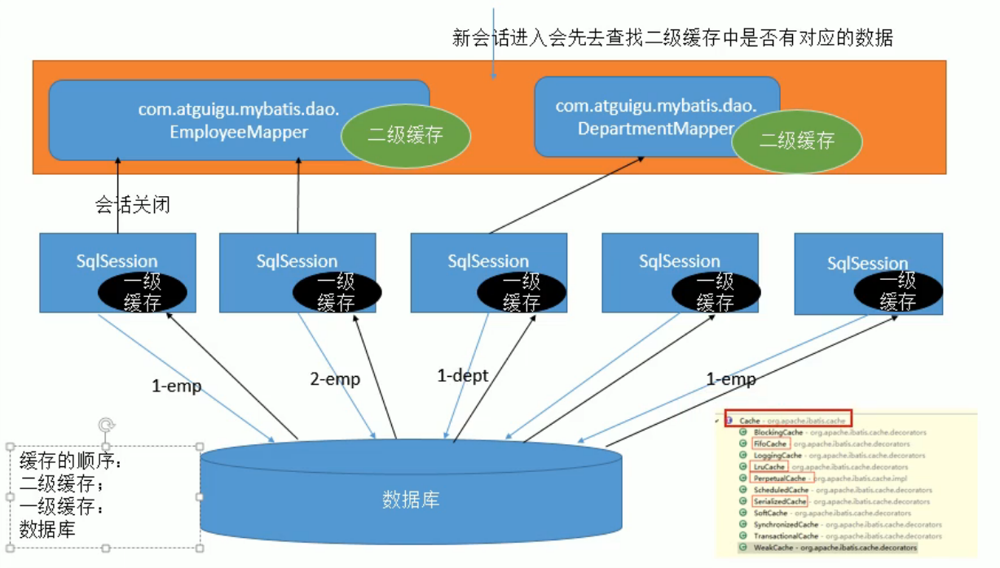

## 一级缓存（本地缓存）：sqlSession级别的缓存，一级缓存是一直开启的，sqlSession级别的Map
    与数据库同一次会话期间查询的数据会放在本地缓存中
    以后如果需要就会获取相同的数据，直接从缓存中拿，没必要再区查询数据库

        一级缓存失效情况（当没有一级缓存的情况时，就得重新获取对象）
            1.sqlSession不同
            2.sqlSession相同，查询条件不同
            3.sqlSession相同，两次查询期间执行了增删改
            4.sqlSession相同，手动清楚了一级缓存

# 二级缓存（全局缓存）：基于namespace级别的缓存，一个namespace对应一个二级缓存
    工作机制：
        1.一个会话，查询一条数据，这个数据就会被放在当前会话的一级缓存中；
        2.如果会话关闭；一级缓存中的数据会被保存到二级缓存中，新的会话查询西悉尼，就可以参照二级缓存
        3.sqlSession===EmployeeMapper==>Employee
                        DepartmentMapper==>Department
                不同namespace查出的数据会放在自己对应的缓存中（map）

                    查出的数据都会默认先放在一级缓存中
                    只有会话提交或者关闭以后，一级缓存中的数据才会转移到二级数据

    使用方法
        1.开启全局配置
```xml
    <settings>
         <setting name="cacheEnabled" value="true"/>
    </settings>
```
        2.开启namespace配置
                eviction:缓存的回收策略：
                    (默认)LRU : 最近最少使用的，移除最长时间不被使用的对象。
                    FIFO : 先进先出，按对象进入缓存的顺序来移除它们。
                    SOFT : 软引用，移除基于垃圾回收器状态和软引用规则的对象。
                    WEAK : 弱引用，更积极地移除基于垃圾收集器状态和弱引用规则的对象。
                flushInterval：缓存刷新间隔，缓存多少毫秒清空一次，默认不清空
                readOnly：是否只读
                    true:只读,mybatis会认为所有从缓存中获取数据的操作都是只读操作，不会修改数据。
                             mybatis为了加快获取速度，直接就会将数据在缓存中的引用交给用户，不安全，速度快
                    false:非只读,mybatis会认为所有从缓存中获取数据可能会被修改。
                             mybatis会利用序列化&反序列化的技术克隆一份新的数据给你，安全，速度慢
                size:存放多少元素；
                type:指定自定义元素的全类名

        3.pojo需要实现序列化接口Serializable
```xml
<!--接口的全类名-->
<mapper namespace="com.gy.Dao.EmployeeMapper">
<cache eviction="" flushInterval="" readOnly="" ></cache>
```

## 和缓存有关的设置/属性
    1)、cacheEnabled=true: false:关闭缓存(二级缓存关闭) (一级缓存一直可用的)
    2)、每个select标签都有useCache="true":false:不使用缓存(一级缓存依然使用,二级缓存不使用)
    3)、【每个增删改标签的: flushCache="true", (一级二级都会清除) 】
            增删改执行完成后就会清楚缓存;
            测试: flushcache="true",一级缓存就清空了;二级也会被清除;
            查询标签: flushCache="false"
                    如果flushCache=true;每次查询之后都会清空缓存;缓存是没有被使的)
    4）、sqlsession.clearCache();只是清楚当前session的一级缓存;
    5)、localcacheScope:本地缓存作用域: (一级缓存SESSION) ;当前会话的所有数据
                        STATEMENT:可以禁用一级缓存; 

## 缓存原理
