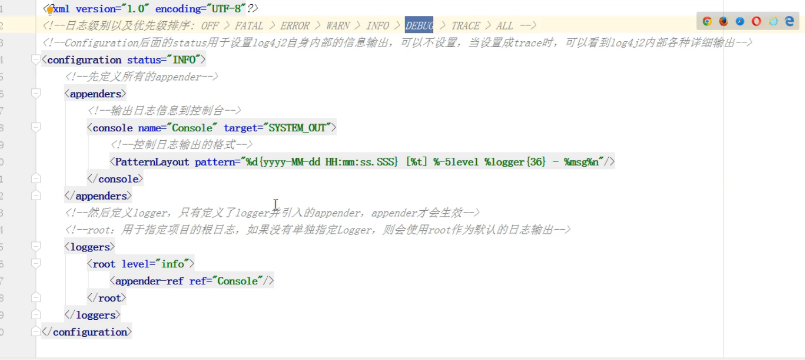
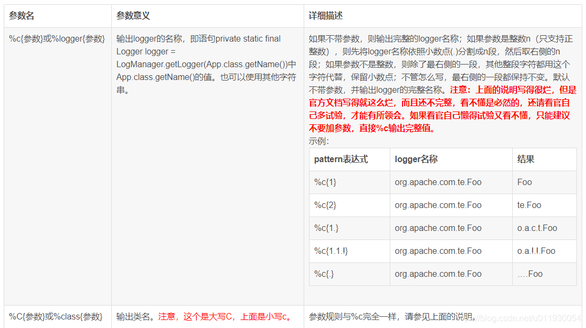
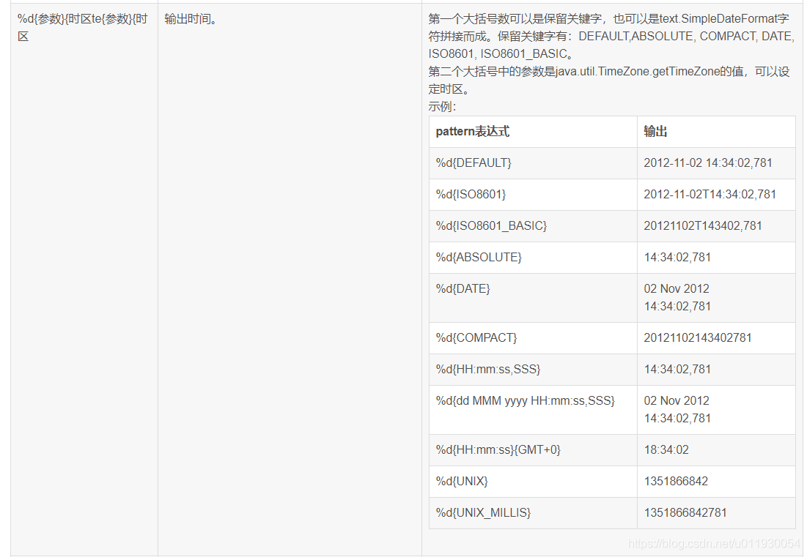
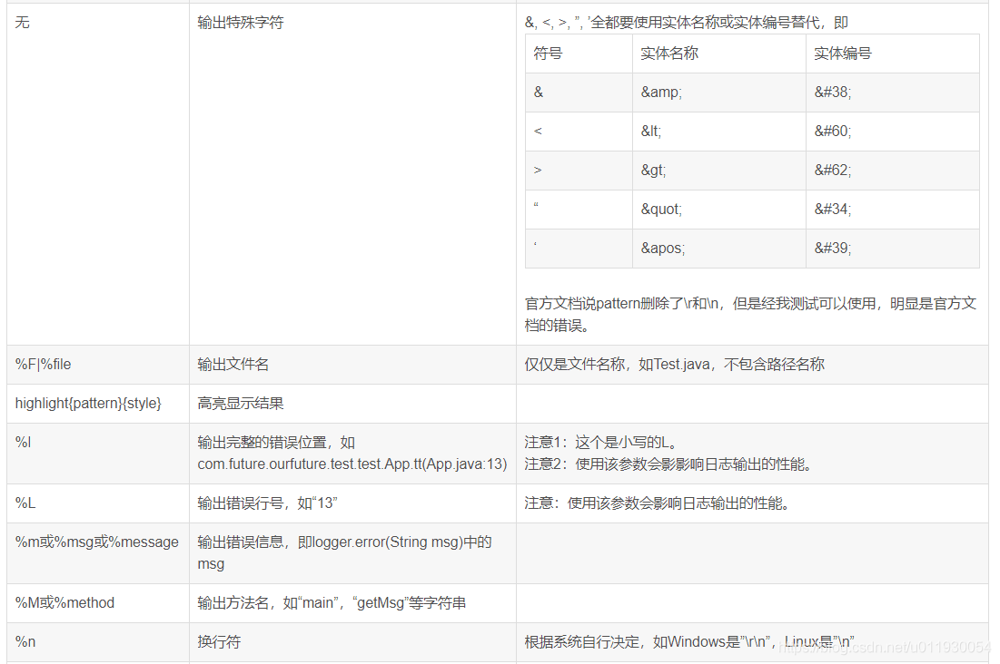
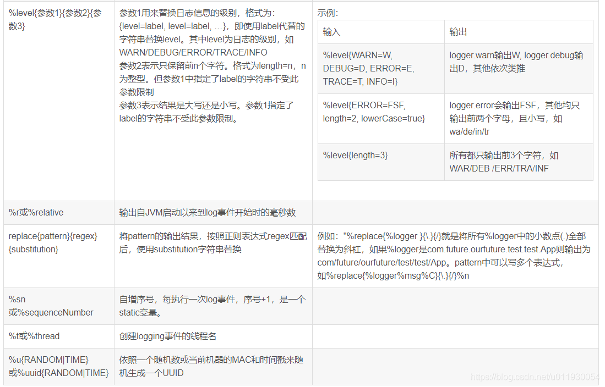

## 整合log4j2



## 完整配置模板
```xml
<?xml version="1.0" encoding="UTF-8"?>
<!--日志级别以及优先级排序: OFF > FATAL > ERROR > WARN > INFO > DEBUG > TRACE > ALL -->
<!--status="WARN" :用于设置log4j2自身内部日志的信息输出级别，默认是OFF-->
<!--monitorInterval="30"  :间隔秒数,自动检测配置文件的变更和重新配置本身-->
<configuration status="WARN" monitorInterval="30">
    <Properties>
        <!--自定义一些常量，之后使用${变量名}引用-->
        <Property name="logFilePath">log</Property>
        <Property name="logFileName">test.log</Property>
    </Properties>
    <!--appenders:定义输出内容,输出格式,输出方式,日志保存策略等,常用其下三种标签[console,File,RollingFile]-->
    <appenders>
        <!--console :控制台输出的配置-->
        <console name="Console" target="SYSTEM_OUT">
            <!--PatternLayout :输出日志的格式,LOG4J2定义了输出代码,详见第二部分-->
            <PatternLayout pattern="[%d{HH:mm:ss:SSS}] [%p] - %l - %m%n"/>
        </console>
        <!--File :同步输出日志到本地文件-->
        <!--append="false" :根据其下日志策略,每次清空文件重新输入日志,可用于测试-->
        <File name="log" fileName="${logFilePath}/${logFileName}" append="false">
            <PatternLayout pattern="%d{HH:mm:ss.SSS} %-5level %class{36} %L %M - %msg%xEx%n"/>
        </File>
        <!--SMTP :邮件发送日志-->
        <SMTP name="Mail" subject="****SaaS系统正式版异常信息" to="message@message.info" from="message@lengjing.info" smtpUsername="message@message.info" smtpPassword="LENG****1234" smtpHost="mail.lengjing.info" smtpDebug="false" smtpPort="25" bufferSize="10">
            <PatternLayout pattern="[%-5p]:%d{YYYY-MM-dd HH:mm:ss} [%t] %c{1}:%L - %msg%n" />
        </SMTP>
        <!-- ${sys:user.home} :项目路径 -->
        <RollingFile name="RollingFileInfo" fileName="${sys:user.home}/logs/info.log"
                     filePattern="${sys:user.home}/logs/$${date:yyyy-MM}/info-%d{yyyy-MM-dd}-%i.log">
            <!--ThresholdFilter :日志输出过滤-->
            <!--level="info" :日志级别,onMatch="ACCEPT" :级别在info之上则接受,onMismatch="DENY" :级别在info之下则拒绝-->
            <ThresholdFilter level="info" onMatch="ACCEPT" onMismatch="DENY"/>
            <PatternLayout pattern="[%d{HH:mm:ss:SSS}] [%p] - %l - %m%n"/>
            <!-- Policies :日志滚动策略-->
            <Policies>
                <!-- TimeBasedTriggeringPolicy :时间滚动策略,默认0点小时产生新的文件,interval="6" : 自定义文件滚动时间间隔,每隔6小时产生新文件, modulate="true" : 产生文件是否以0点偏移时间,即6点,12点,18点,0点-->
                <TimeBasedTriggeringPolicy interval="6" modulate="true"/>
                <!-- SizeBasedTriggeringPolicy :文件大小滚动策略-->
                <SizeBasedTriggeringPolicy size="100 MB"/>
            </Policies>
            <!-- DefaultRolloverStrategy属性如不设置，则默认为最多同一文件夹下7个文件，这里设置了20 -->
            <DefaultRolloverStrategy max="20"/>
        </RollingFile>

        <RollingFile name="RollingFileWarn" fileName="${sys:user.home}/logs/warn.log"
                     filePattern="${sys:user.home}/logs/$${date:yyyy-MM}/warn-%d{yyyy-MM-dd}-%i.log">
            <ThresholdFilter level="warn" onMatch="ACCEPT" onMismatch="DENY"/>
            <PatternLayout pattern="[%d{HH:mm:ss:SSS}] [%p] - %l - %m%n"/>
            <Policies>
                <TimeBasedTriggeringPolicy/>
                <SizeBasedTriggeringPolicy size="100 MB"/>
            </Policies>
        </RollingFile>
        <RollingFile name="RollingFileError" fileName="${sys:user.home}/logs/error.log"
                     filePattern="${sys:user.home}/logs/$${date:yyyy-MM}/error-%d{yyyy-MM-dd}-%i.log">
            <ThresholdFilter level="error" onMatch="ACCEPT" onMismatch="DENY"/>
            <PatternLayout pattern="[%d{HH:mm:ss:SSS}] [%p] - %l - %m%n"/>
            <Policies>
                <TimeBasedTriggeringPolicy/>
                <SizeBasedTriggeringPolicy size="100 MB"/>
            </Policies>
        </RollingFile>
    </appenders>
    <!--然后定义logger，只有定义了logger并引入的appender，appender才会生效-->
    <loggers>
        <!--过滤掉spring和mybatis的一些无用的DEBUG信息-->
        <!--Logger节点用来单独指定日志的形式，name为包路径,比如要为org.springframework包下所有日志指定为INFO级别等。 -->
        <logger name="org.springframework" level="INFO"></logger>
        <logger name="org.mybatis" level="INFO"></logger>
        <!-- Root节点用来指定项目的根日志，如果没有单独指定Logger，那么就会默认使用该Root日志输出 -->
        <root level="all">
            <appender-ref ref="Console"/>
            <appender-ref ref="RollingFileInfo"/>
            <appender-ref ref="RollingFileWarn"/>
            <appender-ref ref="RollingFileError"/>
        </root>
        <!--AsyncLogger :异步日志,LOG4J有三种日志模式,全异步日志,混合模式,同步日志,性能从高到底,线程越多效率越高,也可以避免日志卡死线程情况发生-->
        <!--additivity="false" : additivity设置事件是否在root logger输出，为了避免重复输出，可以在Logger 标签下设置additivity为”false”-->
        <AsyncLogger name="AsyncLogger" level="trace" includeLocation="true" additivity="false">
            <appender-ref ref="RollingFileError"/>
        </AsyncLogger>
    </loggers>
</configuration>
```
## 各部分配置介绍

    Appenders:包含以下标签
    FileAppender 　　 普通地输出到本地文件;
    FlumeAppender　　 将几个不同源的日志汇集、集中到一处;
    RewriteAppender 　　对日志事件进行掩码或注入信息;
    RollingFileAppender　　对日志文件进行封存;
    RoutingAppender　　在输出地之间进行筛选路由;
    SMTPAppender　　将LogEvent发送到指定邮件列表;
    SocketAppender　　将LogEvent以普通格式发送到远程主机;
    SyslogAppender　　将LogEvent以RFC 5424格式发送到远程主机;
    AsynchAppender 　　将一个LogEvent异步地写入多个不同输出地;
    ConsoleAppender　　将LogEvent输出到控制台;
    FailoverAppender　　维护一个队列，系统将尝试向队列中的Appender依次输出LogEvent，直到有一个成功为止;
    其中ConsoleAppender、RollingFileAppender和SMTPAppender较为常用








    %m表示输出所有message消息
    %.300m表示保留message最后30个字符