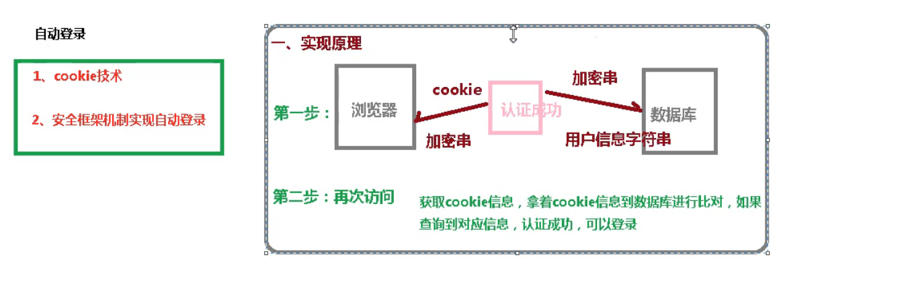
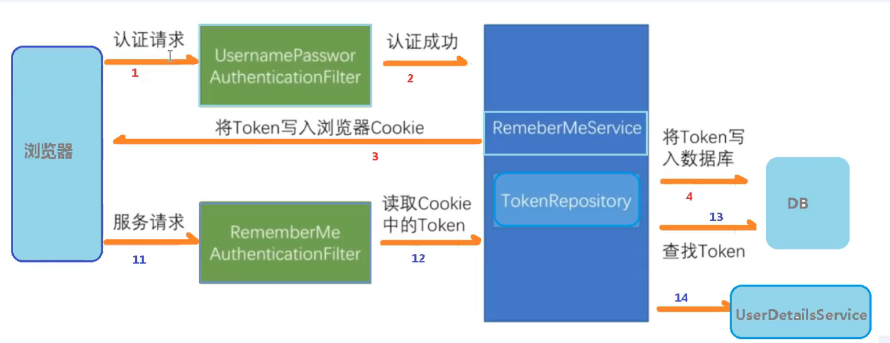

## 基本实现原理


## 详细流程


## 具体实现
    1.创建数据库表
```sql
create table persistent_logins
     (
     	username varchar(50) null,
     	series varchar(50) null,
     	token varchar(50) null,
     	last_used varchar(50) null,
     	constraint persistent_logins_pk
     		primary key (username)
     )
```
    2.配置类，注入数据源，配置操作数据库对象
```java
    //配置数据源
    @Autowired
    private DataSource dataSource;

    //自动登录
    public PersistentTokenRepository persistentTokenRepository(){
        JdbcTokenRepositoryImpl jdbcTokenRepository = new JdbcTokenRepositoryImpl();
        jdbcTokenRepository.setDataSource(dataSource);
        //启动是自动创建表格
        //jdbcTokenRepository.setCreateTableOnStartup(true);
        return jdbcTokenRepository;
    }
```
    3.配置类添加相关链路
```java
                //设置自动登录配置
                .and().rememberMe()
                        .tokenRepository(persistentTokenRepository()) //使用哪个控制器处理token
                        .tokenValiditySeconds(60)   //token存在时间 单位秒
                        .userDetailsService(userDetailsService) //哪个控制器操作数据库对象
```
    4.页面配置自动登录复选框（可选,不配置的话默认登录出现默认按钮）name属性必须是remember-me
```html
    <input type="checkbox" name="remember-me">
```
     