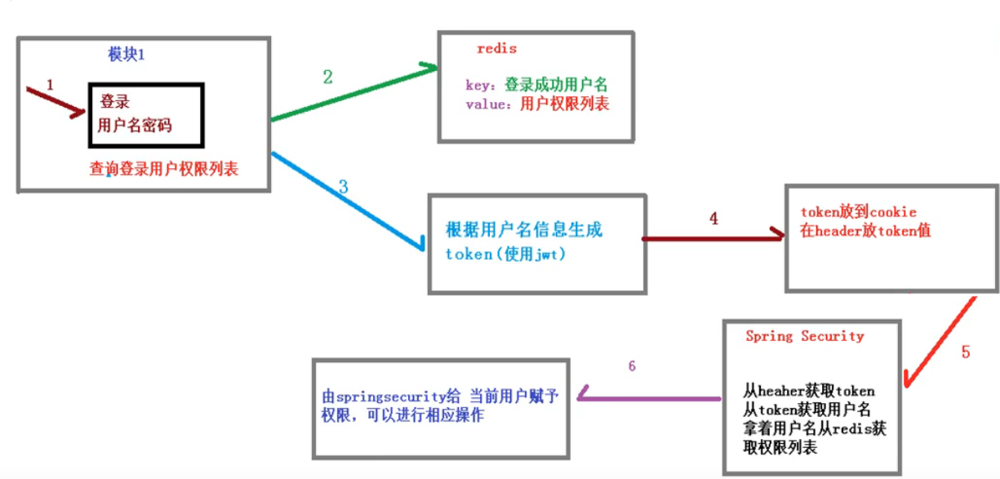
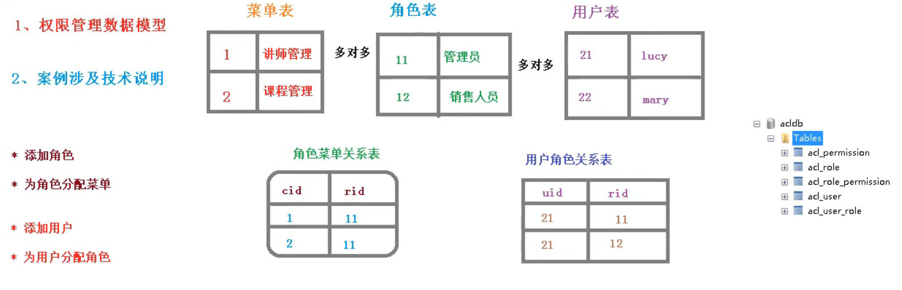
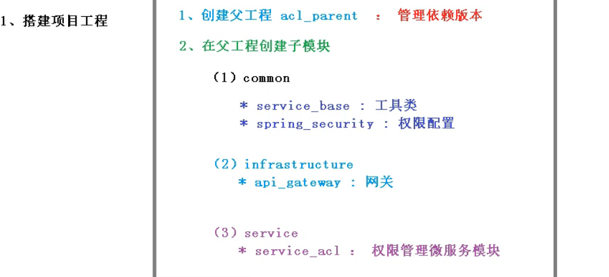

## 什么是微服务
    
## 单点登录（SSO）

## 认证和授权实现过程
    1.如果是基于Seesion，那么Spring Security会对Cookie里面Sesseionid进行解析，
        找到服务器存储的session信息，然后判断当前用户是否符合请求的要求。
    2.如果是token,则是解析出token，然后将当前请求加入带Spring Security管理的权限信息中去。
    
    基于token的实现思路

## 数据模型

## 工程搭建
